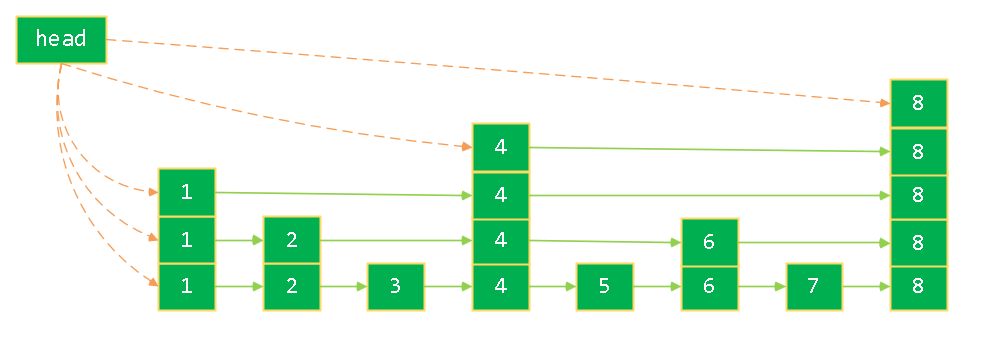
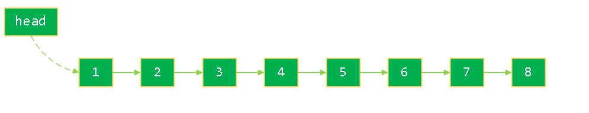
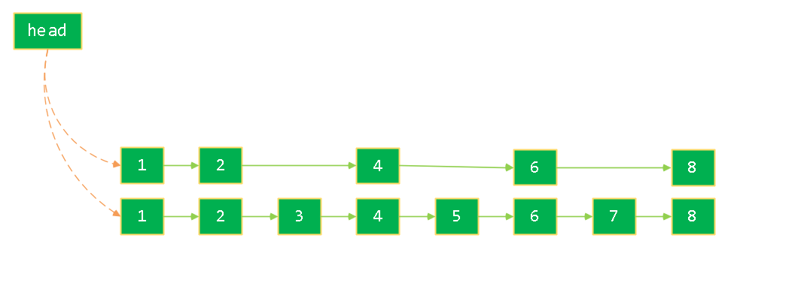
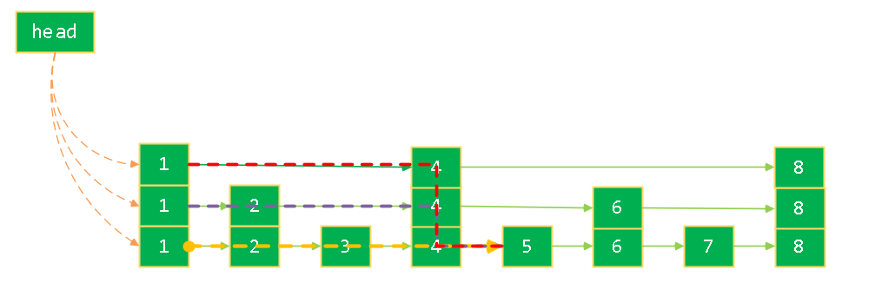
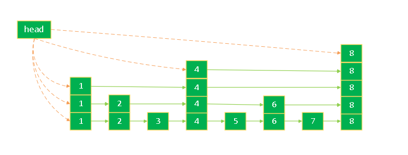
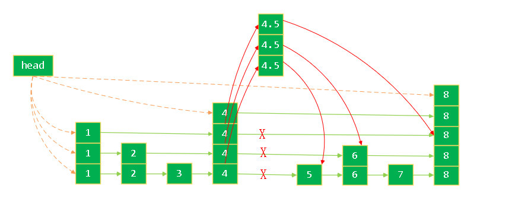
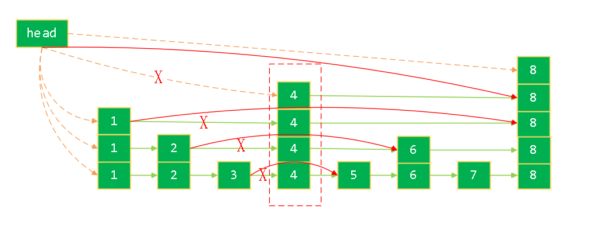
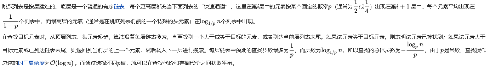

# 跳表


### 前言

文中附代码实现. [电梯直达](#代码实现)

在公众号回复 【跳表】 也可以获取哦。

### 什么是跳表

> 跳表是一种数据结构。它允许快速查询一个有序连续元素的数据链表。跳跃列表的平均查找和插入时间复杂度都是O(log n)，优于普通队列的O(n)。
 <p align=right> from. 维基百科</p>

### 引题

线性表这种数据有两种具体实现, 数组和链表。具体的内容之前的文章里也有说过，可以翻翻看哇~。在这里两种数据结构中，数组的优点是查找速度快,而链表的优点是增删的效率高，这也是我们常说的。其实，非也。

数组是一种内存连续的数据结构,其优点是可以通过`首地址+N*(sizeOf(Node))` 来快速获取指定位置上的元素.假如我们不知道指定元素的位置呢?

链表是一种非内存连续的数据，其优点是通过改变指针地址来快速增减元素。很明显的问题，你首先要知道你要增加/删除的目标元素是哪个! 所以会浪费 `O(n)` 的查询时间。

要论效率, 那就要说平衡树(`AVL`)了。增删查的效率都是 `O(logN)`。 但是这种数据结构, 原理比较复杂,实现起来那不是比较复杂了，那是相当复杂。增删操作，都需要其依靠平衡操作引发子树的调整。

那么, 掌声有请我们今天的主角: <b>跳表</b>。

### 跳表

##### 概念

跳表(`skip list`) 全称 跳跃链表。 是一种类链表的数据结构。

跳表的性能和平衡树的性能是一样的，在插入，删除，搜索的时间复杂度都是 `O(n)`, 是一种利用空间换时间的数据结构。

跳表是一种随机化的数据结构，目前开源软件 Redis 和 LevelDB 都有用到它。

这里，先给大家看一个<b>可能</b>的跳表结构。



现在我要告诉你，上面的跳表是由下面的跳表经过层层优化得来的。



下面我们针对上面的跳表结构来分析一下。

刚才说过了，链表增删性能罪魁祸首就是查找操作! 对于查找操作，效率最高的莫过于二分查找了。但是对于第一个有序链表中是无法使用二分查找的。但是呢，我们可以随机抽选中其中的几个元素，组成一个新的链表。就像下面这样。



假设我们要找`5`这个元素,在单独的有序链表中，我们必须从头结点依次遍历到 `5` 这个节点。路径为`1->2->3->4->5`,下图中黄色线路径。,现在，我们只需要从 `1->2->4->5`.下图中紫色线路径。既然我们可以原来的链表抽象出一个新的链表, 那我们还可以从新的链表中再抽象出一个新的链表。这样的话，就直接可以 `1->4->5`,就可以查到一个我们的目标节点了。



如果你看到这里，我要告诉你一个重要的概念了。

<strong>层：就是我们假设的抽象出来的新链表。</strong>

可能你很好奇, 层我们应该怎么存储呢? 很简单啊！

以后我们每个链表的元素是怎么定义的??

```c++
typedef struct NODE {
    T data;
    Node *next;
} node;
```

我们只需要将 指向下一个元素的指针改成一个指针数组就可以了！

```c++
typedef struct NODE {
    T data;
    /// 指向后继元素的指针数组
    struct Node *next[i];
} node;
```

了解了怎么存储之后，那怎样确定某个节点有几层呢? 这里我告诉你吧，随机的！怎么随机的呢? 就是通过随机数来确定的，也就是我们常说的 抛硬币的形式。 比如下面的这段代码.

```c++
/**
 * 生成一个随机数
 * @return 一个随机数
 */
int random_level() {
    int level = 1;
    while (rand() % 2) {
        level++;
    }
    level = (level < MAX_LEVEL) ? level : MAX_LEVEL;
    return level;
}
```

那我们就尝试着实现一个跳表。

#### 跳表的实现

* 定义跳表的结构

经过上面的分析, 每个节点指向下一个节点的指针是一个数组，所以我们得出下面的结构。(当然也有其他方式的实现,欢迎交流~)

```c++
/// 节点
NODE {
    T data,
    /// 指向下一个节点的数组，从1开始。
    /// 数组中的每个元素对应该层的下一个节点
    /// next[1],是第一层的下一个节点的地址。
    /// next[2] 是第二层的下一个节点的地址。
    NODE []next;
}

/// 跳表
SKIP_LIST{
    NODE head;
    /// 该跳表的层数
    int level;
}
```

* 查找指定的元素

上面说过了 查找过程，我这里就直接给出伪代码了。

主要逻辑是: 从高层开始查找直到找到等于指定元素的节点E 或者第一个大于指定元素的节点G。如果是节点E，那么直接返回就好了。如果是G节点, 那么就以G节点的前一个节点L,在下一层进行查找，重复上面的逻辑，直到找到节点E，或者到达跳表的结尾。

比如下图中查找 `5` 的过程为:



* `head->8`, `8>5`,从`head`开始，去下一层查找。
* `head->4->8`, `8>5`,从 `4` 元素开始查找。去下一层查找
* `head->4->8`, `8>5`,从 `4` 元素开始查找。去下一层查找.
* `head->4->6`, `6>5`,从 `4` 元素开始查找。去下一层查找.
* `head->4->5`, `5==5`,返回节点`5`.

如下面的伪代码。

```c++
search() {
    /// i 表示层数，从最高层开始查找 。
    for (; i >= 0; i--) {
        while ((q = p->next[i]) && q->k < k) {
            p = q;
        }
        if (q && k == q->data) {
            return &(q->data);
        }
    }
}
```

* 构建一个跳表。

上面分析可以得出来，跳表是一个多层的有序链表。所以我们对于每一层都像操作普通链表一样就可以了。就像下面的这样:



```c++
insert () {
    // 找到要插入的节点位置。
    // level是本跳表的层数
    for (i = level-1; i >= 0; i--) {
        ///遍历该层小于指定值的前一个元素
        while ((q = p->next[i]) && q->k < k) {
            p = q;
        }
        /// 新节点的前一个节点的层指针。
        update[i] = p;
    }

    // 随机生成该节点的层数,如果生成的层数大于当前层，需要更新跳表中记录的level值。
    new_level = rand_level();
    if(new_level > level) {
        level = new_level;
    }
    
    // 生成新的节点，并针对每一层执行普通链表的插入操作。
    new_node = create_new_node();
    for (i = level - 1; i >= 0; i--) {
        /// 下面两行代码就是普通连接的增加方法。
        /// 新节点的前一个节点的第i层的节点。
        new_node->next[i] = update[i]->next[i];
        update[i]->next[i] = q;
    }
}
```

* 删除跳表的元素

主要逻辑是该节点的每一层都要删除.

即对每一层,都要 要删除节点的上一个节点指向要删除节点的下一个节点。



```c++
del() {
    /// 找到要删除的节点
    for (; i >= 0; --i) {
        while ((q = p->next[i]) && q->k < k) {
            p = q;
        }
        update[i] = p;
    }
}
```

#### 代码实现

##### 已实现:

[跳表`C`语言版本](https://github.com/fangjiaxiaobai/data_structures_and_algorithms/tree/master/01_data_structures/skiplist/c/01_fangjiaxiaobai)
[跳表`JAVA`版本](https://github.com/fangjiaxiaobai/data_structures_and_algorithms/tree/master/01_data_structures/skiplist/java/fangjiaxiaobai)

其他语言，比如 `python`, `golang`, `c++`, `js`, `php`, `kotlin` 版本的代码, 你有没有兴趣搞一波呢？[赐教地址](https://github.com/fangjiaxiaobai/data_structures_and_algorithms)

各位看官可以选择自己熟悉的语言查看。实现代码仅供参考。如有高见，欢迎交流哇~, 还请不吝赐教！

也欢迎大侠提交自己擅长语言的代码到仓库~, 集思广益，一起交流！期待~~

(仓库中的数据结构与算法持续更新哦，欢迎`star`)

### 时间复杂度的分析

因为跳表的时间复杂度和跳表的层数以及该层上的节点数和节点分布的位置有关，而这些因素都是随机的。 此中涉及了很多复杂的概率统计学知识。所以我就摘自维基百科中的说明，如下:



如果看的不是很清晰，也可以这么想：

如果每两个节点抽出一个节点作为上一级索引的节点，那第一级索引的节点个数大约就是 `n/2` ,第二级索引是 `n/4`, 第三级就是 `n/8`。 也就是说 第 `k` 级索引节点个数是 `n/(2^k)`;

假设,我们有 `h` 层, 最高层索引有`2`个节点,那么， 就是 `n/(2^k)=2`, 那么 $k=log_2N-1$，这个链表的高度就是 $log_2N$. 如果每一层要遍历 `m` 个节点,那么在跳表中查询一个数据的时间复杂度就是`O(m*logN)`.

由于随机分布的存在，我们可以把m当做一个常数, 所以, 时间复杂度大致可以认为是 `O(logN)`

### 空间复杂度的分析

根据整体代码实现来看, 我们使用了链表的形式来实现. 其中，`next` 改成了数组用来存储下一节点的指针,并没有真正的存储对象,. 也就是说,其实我们并没有使用很多的内存, 当然，比一般的链表还是要多一些的。对于我们存储的对象来讲，用于存储指针的内存直接就可以忽略了。时间复杂度为 `O(N+m)`,其中 `N>>m`(`N`远远大于`m`).

### 比较

##### 跳表 与平衡树、哈希表的比较

|  | 跳表| 平衡树 | 哈希表 |
|:----:|:----:|:----:|:----:|
| 有序性 | 有序 | 有序| 无序|
| 查找性能| O(logN) | O(logN) | O(N) |
| 实现逻辑| 简单| 复杂 | 简单|
| 是否支持范围查找 | 支持| 支持| 不支持(无序) |
| 时间复杂度 | 较少,取决p参数 | 较大(和跳表比,占用左右子树的两个指针) | 一般 |

##### 解释如下:
 
* 在做范围查找的时候，平衡树比跳表操作要复杂。在平衡树上，我们找到指定范围的小值之后，还需要以中序遍历的顺序继续寻找其它不超过大值的节点。如果不对平衡树进行一定的改造，这里的中序遍历并不容易实现。而在跳表上进行范围查找就非常简单，只需要在找到小值之后，对第`1`层链表进行若干步的遍历就可以实现。
* 平衡树的增删操作可能引发子树的平衡调整，而跳表的插入和删除只需要修改相邻节点的指针，操作简单又快速。
* 从内存占用上来说，跳表比平衡树更灵活一些。一般来说，平衡树每个节点包含`2`个指针（分别指向左右子树），而跳表每个节点包含的指针数目平均为`1/(1-p)`，具体取决于参数`p`的大小。如果像`Redis`里的实现一样，取`p=1/4`，那么平均每个节点包含`1.33`个指针，比平衡树更有优势。
* 查找单个`key`，跳表和平衡树的时间复杂度都为`O(log n)`，大体相当；而哈希表在保持较低的哈希值冲突概率的前提下，查找时间复杂度接近`O(1)`，性能更高一些。

我还从网上看到了`Redis`的作者选择 跳表做为`zset`底层数据结构的原因, 贴在下面。

##### `Redis`中作者选择SkipList的原因:

> There are a few reasons:
> 1) They are not very memory intensive. It’s up to you basically. Changing parameters about the probability of a node to have a given number of levels will make then less memory intensive than btrees.
> 2) A sorted set is often target of many ZRANGE or ZREVRANGE operations, that is, traversing the skip list as a linked list. With this operation the cache locality of skip lists is at least as good as with other kind of balanced trees.
> 3) They are simpler to implement, debug, and so forth. For instance thanks to the skip list simplicity I received a patch (already in Redis master) with augmented skip lists implementing ZRANK in O(log(N)). It required little changes to the code.

### 总结

* 简单的从性能角度分析了数组和链表在性能方面的障碍,引出了我们今天的主角： 跳表。
* 画了一个可能出现的跳表结构. 这是与跳表的初次见面。并介绍了二分查找的变相应用。当前，这都是基于有序链表为前提的。
* 介绍了链表的层的概念，这是跳表相对于链表最重要且唯一的概念，有了它才有了时间复杂度为`O(logN)`的查询效率,从而实现了增删操作的时间复杂度也是`O(logN)`。
* 接下来，我们一起完成了跳表的实现逻辑。并且提供了多种语言的跳表实现版本. 希望你也提交代码到仓库中，大家一起交流, 期待。
* 跳表在发展的过程中也出现几个变种，我们的这个只是一个最简答的实现。甚至我们都没有考虑过元素个数与层数的最优解等等问题.后面会有一篇文章分享的是`Redis`中`skiplist`的实现. 敬请期待吧~

### 推荐

[某高校跳表公开课(需科学上网)](https://www.youtube.com/watch?v=2g9OSRKJuzM)

### 最后

期待你的关注,大家一起交流切磋~


