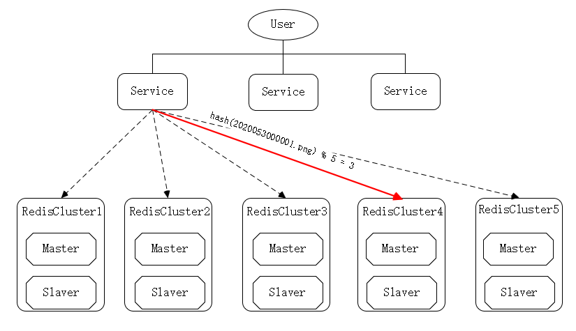
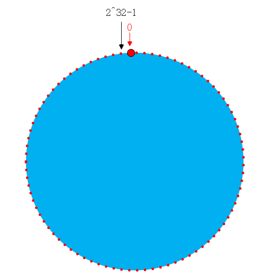
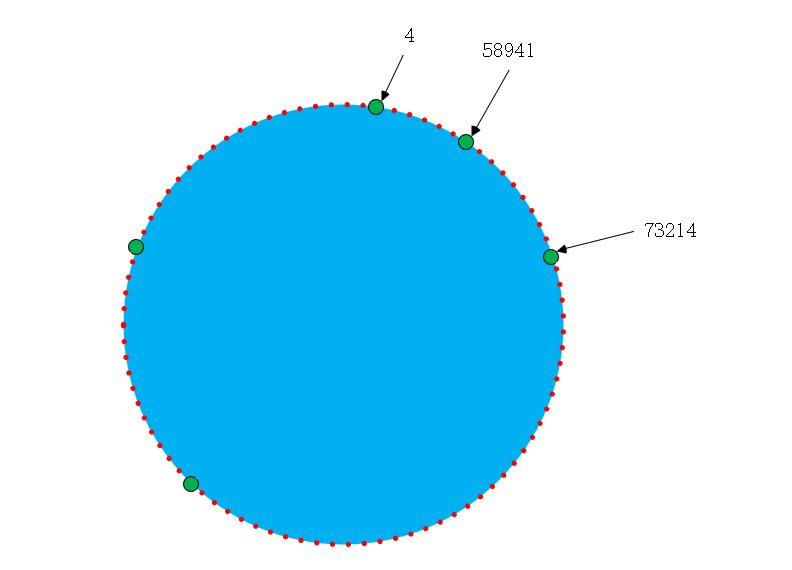
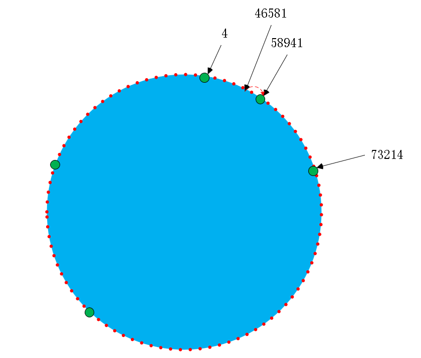
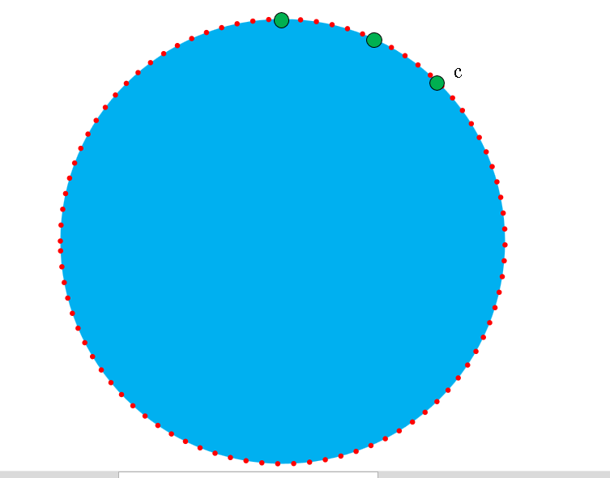

# 哈希算法

今天搞下哈希算法

## 简介

哈希算法，又称为: 散列函数, 散列算法。

哈希算法是指将任意长度的二进制值串映射为固定长度的二进制串的这一规则。

举个例子: `Jdk`的`HashMap`中。

```java
static final int hash(Object key) {
    int h;
    return (key == null) ? 0 : (h = key.hashCode()) ^ (h >>> 16);
}
```

看似实现非常简单，但是设计一个优秀的哈希算法却不是简单的事情。优秀的Hash算法有什么要求?

* 从Hash值不能反向推导出原始数据，所以哈希算法也叫单向哈希算法。
* 对输入数据敏感，修改了原始数据中的一个bit，最后得到的哈希值也大不相同。
* 哈希冲突(也叫哈希碰撞)的概率要很小，对于不同的原始数据，哈希值相同的概率非常小。
* 哈希算法的执行效率要尽量高效，针对较长的文本，也能快速地计算出哈希值。

我们再来看一个哈希算法的例子: MD5() 函数。

```java
public class MD5Demo {
    public static void main(String[] args) throws NoSuchAlgorithmException {
        System.out.println(md5("123456789")); // 25f9e794323b453885f5181f1b624d0b
        System.out.println(md5("123456788")); // f5f091a697cd91c4170cda38e81f4b1a
    }
    private static String md5(String input) throws NoSuchAlgorithmException {
        MessageDigest md5 = MessageDigest.getInstance("MD5");
        md5.update(input.getBytes());
        byte[] digest = md5.digest();
        return new BigInteger(1, digest).toString(16);
    }
}
```

首先从哈希后的串反推出原始字符串是非常困难的。在第二个字符串仅仅是将9改成了8，但是Hash后的值是完全不一样的。
对于任何一种哈希算法我们都只能尽量的减少其冲突的概率，理论上是不可能做到完全不冲突的。在组和数学中有一个著名的理论就是：抽屉原理，也叫鸽巢原理。如果有10个鸽巢，但是有11只鸽子，那么肯定会有一个鸽巢中的鸽子数量多于一个。也就是肯定会有一个鸽巢里有两只鸽子。同理而言，不管我们对什么样的数据进行哈希运算，得出的哈希值的长度是固定的，但是要哈希运算的原始数据确实无穷无尽的。以MD5算法为例。我们生成了32位的16进制数的字符串，那么我们生成串的可能性为 16^32 种。如果我们是第 16^32 + 1 个数据进行哈希运算肯定就会产生 哈希冲突。

但是：我们可以轻易的得出这样一个结论:

<b>哈希值越长的哈希算法，散列冲突的概率越低</b>

那么哈希算法，主要应用在哪些方面呢?

### 哈希算法的应用

#### 安全加密

上面我们提到了 MD5 算法，这个是老生常谈的加密算法了，据说已经被破解了。

* MD5 算法 : message digest Algorithm MD5消息摘要算法。
* SHA 算法 : Secure Hash Algorithm 安全散列算法
* DES 算法 : data Encryption Standard 数据加密标准
* AES 算法 : Advanced Encryption Standard 高级加密标准。

对用于加密的哈希算法，有两个特别重要的要求: 1.很难通过Hash值推导出原始的字符串。2.散列冲突的概率要很小。

#### 唯一标识

* md5: 例如：我们可以把每个图片的唯一标识，图片的路径都存储到散列表中，要查看什么图片的时候可以根据唯一标识去查到对应的图片。

#### 数据校验

* 我们常说的，检验一个文件是否被修改过，要检验下md5值。我们可以通过对比，来校验数据的完整性和正确性。

#### 散列函数

* Java中 HashMap等用来计算哈希值。对散列的平均性和哈希算法的执行效率要求较高。

#### 负载均衡

* 负载均衡算法，有很多，比如轮询算法，随机算法，加权轮询算法。

#### 数据分片

* 典型的数据库的分库分表等海量数据的查询场景

#### 分布式存储

* 这种的就是对海量数据的存储场景。比如分布式缓存(Redis)，如何判断该条数据分配在哪台Redis中。

<b>哈希算法的几种使用场景，介绍完毕，我们重新来看看这种Hash算法在应用中有什么缺陷</b>

在负载均衡，数据分片，分布式存储三种场景中，都有一个明显的特点就是，通过分布式集群的方式来对海量数据进行处理。

这时，假设在集群中突然一台机器宕机，被迫下线。这时会出现什么问题呢?

我再来详细的描述下这个场景。

以分布式缓存为例：

假设我们使用Redis集群做图片资源的缓存，Redis的key是图片的名称，value是对应服务器的路径。如果数据是1000w，那么我们用5台服务器进行缓存，每台服务器大于200w数据，并且是都是主从的架构。
如下图：



很简单的存储方式： 我们对没他图片的名称进行哈希运算，并对得出的哈希值和5进行取模运算，得到这个图片资源所在的服务器，去获取数据。
比如： hash(2020053000001.png) % 5 = 3，表示位于第4台服务器上。

<b>很不幸!!!, 突然有台机器宕机了，并且这台机器被踢下线了，集群中机器由 5 台 变成了 4 台 (减)</b>

那么这时会有什么问题呢？ 我们会发现所有的图片资源都无法命中缓存资源了。这时就出现所谓的 "缓存雪崩"。

为什么呢?   本来 hash(2020053000001.png) % 5 = 3，由于集群中只有 4 台机器了，那么 hash(2020053000001.png) % 4 = 3 就一定不会是3了吧！

这时候你就说了，我们还是对 5 取模不就行了？这样至少其他4台缓存服务器还可以正常提供服务。但是这样所有命中宕机服务器的缓存都会打到数据库，这样还是有可能直接导致数据库宕机的！

怎么办呢?

<b>一波不平，一波又起! 随着访问量的增大，缓存服务器不堪重负！缓存服务器要从5台增加到8台！(增)</b>

同样的问题： hash(2020053000001.png) % 5 = 3 ，但是 hash(2020053000001.png) % 8 = ?? ,有一次“雪崩!”

怎么办呢?

<b>第三波! 经过长时间的监控, 发现缓存服务器的压力主要集中在晚上的 7:00 - 10:00 之间，其他时间段的压力就很小!(假)</b>

要求实现可以动态的扩张和缩小集群的数量。

怎么办呢？

<b>重要嘉宾： 一致性哈希算法</b>

什么是一致性哈希算法呢?

刚才在第一波的时候，说过我们可以对5取模啊。这个思路是可以的，但是不能根据集群中服务器数量来进行取模运算，而是要对一个固定大的数来取模运算（2^32=4294947297（最大的非符号整形数））。 那哈希值对应的位置上没有机器怎么办? 我来解释下，一致性哈希算法的整体逻辑：

一致性哈希算法是将整个哈希值空间组织成一个虚拟的圆环。而且这个哈希值空间的大小为 `[0, 2^32-1]`,如下图。

从0开始，顺时针计数，直到 2^32-1, 这 2^32 个点组成的圆环称为 Hash 环。



还是以上面的场景， 5台服务器随机分布在环上，如下图，



常量 MAX_VALUE = 2 ^ 32;

* 假设图片资源: hash(20200530004562.png) = 4；如果第4个位置上正好有一台服务器，就直接将这个条数据缓存到该台服务器上。
* 假设图片资源：hash(20200530015456.png) = 46581；在第46581上并没有服务器，那么以顺时针的方向，进行遍历，直到遇到第一台服务器58941，缓存到该台服务器58941上。

如下图:



我们再来看看我们的三波:

* <b>突然有一台机器宕机！</b>

假设 65594 这台机器宕机，那么就无法查询缓存在65594这台机器上的数据，程序会顺时针方向进行查找，找到73214这台机器，获取缓存为空，查询数据库后将数据缓存到73214这台机器上。

* <b>新增机器到集群中</b>

假设 在集群节点号 73214 和 138956 之间插入一台机器 100354 。那么原来 hash在 (73214,100354]之前的数据，就不会缓存到138956节点了，

* <b>动态</b>

在新增和删除完成之后，动态，理论上也是OK的。具体实现的话，就是监控访问流量，根据流量阈值设置动态的扩展和“踢下线机器”(将机器给其他业务用)。

### 一致性哈希缺点

#### 数据倾斜

一致性哈希算法，当在服务器节点数量太少的时候，容易出现分配不均而导致数据倾斜。比如，我们有三台服务器，如下图分布:



假设大量数据哈希后的值在 [C,MaxValue]之间，那么所有的数据都会散列到第1个节点上。

这种问题，怎么解决呢？

<b>虚拟节点</b>

假设我们有5台服务器节点，防止各节点分布不均匀的问题，我们可以一台服务其进行多次哈希运算，从而虚拟出个节点。

假设我们原来对服务器1的IP (192.168.0.1)进行哈希，我们使用虚拟节点的方式进行哈希的时候, 我们可以对（192.168.0.1#1），（192.168.0.1#2），（192.168.0.1#3），（192.168.0.1#4）。这样5台机器，就可以有20个节点。从而加大了哈希后分布的随机性。解决了服务节点少时数据倾斜的问题。实际应用中，至少要大于 32 。

好了，关于一致性哈希的相关内容,本篇文章就介绍到这里。

<b>下一篇文章《一致性Hash算法的实现》请期待 </b>

如果有什么问题，欢迎你私信我，我们一起交流哇。

