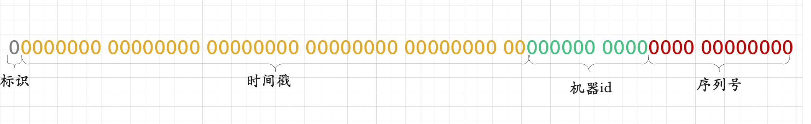

# 雪花算法

### 介绍

雪花算法是 `twitter` 开源的由 `64` 位整数组成的分布式`id`。目的是在分布式系统中产生全局唯一且趋势递增的`ID`。

其核心思想就是：<b>使用一个 `64 bit` 的 `long` 型的数字作为全局唯一 `id`。在分布式系统中的应用十分广泛，且`ID` 引入了时间戳，保持自增性且不重复。</b>

### 雪花算法的结构

* 标识： 没有实际意义。一般都是0，都是正数。
* 时间戳： `41 bit` 可以表示的数字多达 `2^41 - 1`，也就是可以标识 `2 ^ 41 - 1` 个毫秒值，换算成年就是表示 `69` 年的时间。
* 机器id: 这里标识的是机器的唯一标识，一般由两部分构成：`机房id+机器id`。一共`10`位，可以表示`1024`台机器。
* 序列号：可以用这个 `12 bit` 代表的数字来区分同一个毫秒内的 `4096` 个不同的 `id`。也就是同一毫秒内同一台机器所生成的最大ID数量为`4096`

### 雪花算法的工作流程

以一个简单的雪花算法工作流程来说。假设有一个服务假设要生成一个全局唯一`id`，那么就可以发送一个请求给部署了 `SnowFlake` 算法的系统，由这个 `SnowFlake` 算法系统来生成唯一 `id`。这个 `SnowFlake` 算法系统首先肯定是知道自己所在的机器号，（假设机器id为10bit）接着 `SnowFlake` 算法系统接收到这个请求之后，首先就会用二进制位运算的方式生成一个 `64 bit` 的 `long` 型 `id`，`64` 个 `bit` 中的第一个 `bit` 是无意义的。接着用当前时间戳（单位到毫秒）占用`41` 个 `bit`，然后接着 `10` 个 `bit` 设置机器 `id`。最后再判断一下，当前这台机房的这台机器上这一毫秒内，这是第几个请求，给这次生成 `id` 的请求累加一个序号，作为最后的 `12` 个 `bit`。

### 雪花算法实现

完整代码: [代码](./snowflake/src/SnowFlakeGenerator.java)
